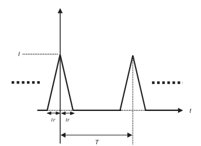
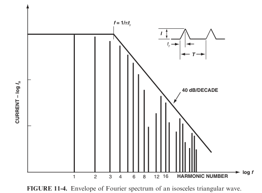
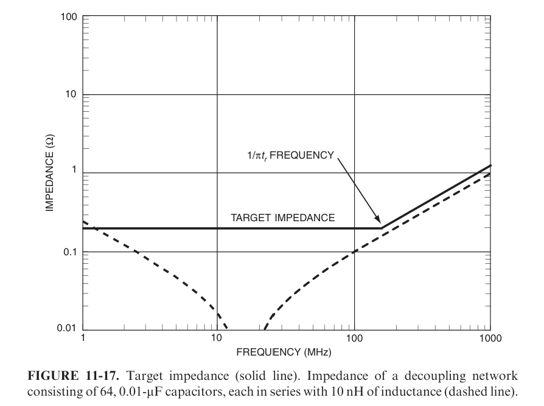

Calculation of the maximum impedance a PDN should provide is often a complex task, partly because frequency domain representations are used instead of time domain representations which here make calculations much easier.

## Comments on PDN maximum impedance calculation method

### Typical approach

The typical approach, well explained by Ott, is as follows:

1/ Approximate the current drawn by the chip by a series of trapezoidal pulses:

From Ott, p. 428.

2/ Express the Fourier transform of this current as such (Ott, p. 429):

<latexmath>
I_n = \frac{2 \cdot I \cdot t_r}{T} \cdot \left[ \frac{\sin(\frac{n \cdot \pi \cdot t_r}{T})}{\frac{n \cdot \pi \cdot t_r}{T}} \right]^2
</latexmath>

Use the following enveloppe as a simpler upper bound (Ott, p. 430):

Calculate the low frequency part as such:

<latexmath>
Z_t = \frac{k \cdot \Delta V}{\Delta I}
</latexmath>

where <asciimath>\Delta V</asciimath> "is the allowable power supply transient voltage variation", <asciimath>\Delta I</asciimath> "is the amplitude of the transient power supply current drawn by the IC", and k a correction factor taking into account the part of the current "contained in the frequencies below the 1/π tr frequency" (Ott, pp. 446-447).

3/ From this curve, calculate the maximum allowed impedance as (Ott, eqn. 11-7 rearranged, p. 445):

<latexmath>
L_\text{max} = \frac{Z_t \cdot t_r}{2}
</latexmath>

Oh. God. Why cannot we make things simple ?

### Alternative time-domain approach

We propose here an alternative approach:

1/ As usual.

2/ From the curves, allocates a maximum R and L such that <asciimath>R \cdot I_(pk) + L \cdot I_(pk)/t_r <= Delta V_"max"</asciimath>. Note the solution is not necessarily unique. A starting point could be to allocate the same delta to both terms.

3/ (Optional) from R and L, calculate a maximum allowed impedance vs. frequency.

Note that, here, R and L can be seen not only as physical elements, but also as convenient calculation tools, for example when modelling something whose behavior is more complex than a pure R and L.

## Current drawn by capacitive loading

The repetition rate of the charge of the capacitive loads might seem an important point. However, the R+L model shows that the repetition rate has almost no importance and that the dominant parameters are the rise and fall times. Anyway, a reasonable model for synchronous circuits is that this current is drawn at fCLK/4, following this typical scenario:

* CLK ↑, output ↑, capacitor charges from Vcc

* CLK ↓, output =

* CLK ↑, output ↓, capacitor discharges to GND

* CLK ↓, output =

Peak current can be calculated from charge conservation from the curve: <asciimath>I_"pk" = C_l \cdot V_"cc" / t_r</asciimath>.

## Current drawn by chip consumption (cross-conduction of the gates)

This one is more tricky. Most circuits are synchronous nowadays so mainly this case will be studied. Circuits having multiple clock domains can also be studied with this method. It will also be asumed that the current spikes will be dominant on rising edges rather than on falling edges, which is a reasonable worst case.

The calculation is better made from the total consumption, easier to measure and to define, than from other parameters like Cpd. From similar charge conservation considerations than previously, calculation lead to <asciimath>I_"TOTAL" = I_"pk" \cdot t_r \cdot f_"CLK"</asciimath>, and thus <asciimath>I_"pk" = I_"TOTAL" / (f_"CLK" \cdot t_r)</asciimath>.

## What to do if tr is missing ?

In lots of cases, tr is missing, like for instance in the MSP430 datasheet.

In this case, stay concistent with the geometry: one capacitor per Vcc pin, size consistent with the sizes of the pins. Components are designed to work, and their internal rise and fall times will be consistent with the pins inductances and so on. Sure this is not perfect, but this is the best you can do in this case.
