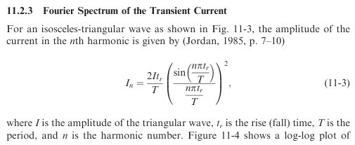

One important topic about the PCB is to calculate the maximum allowed impedance see by a chip. The typical approach, well explained by Ott, is as follows:

1/ Approximate the current drawn by the chip by a series of trapezoidal pulses:

From Ott, p. 428.

2/ Make some math to calculate a maximum allowed impedance from this, with some nasty constants like π.

From Ott, pages 429-430.

3/ Make something with this maximum allowed impedance, using math again, for instance calculate a maximum allowed R and L.

Oh. God. Why cannot we make things simple ?

We propose here an alternative approach:

1/ As usual.

2/ From the curves, allocates a maximum R and L such that Rit+Ldi/dt<=ΔVmax. Note the solution is not necessarily unique. A starting point could be to allocate the same delta to both terms.

3/ From R and L, calculate a maximum allowed impedance vs. frequency.

Note that, here, R and L can be seen not only as physical elements, but also as convenient calculation tools, for example when modelling something whose behavior is more complex than a pure R and L.
